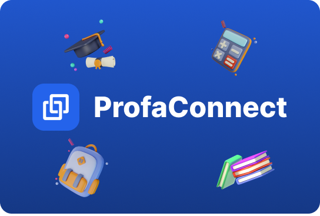

  

# Profaconnect

**Profaconnect** est une plateforme construite avec Next.js, NextAuth, et Prisma qui permet aux enseignants et aux étudiants de rester connectés via des fonctionnalités interactives telles qu'un calendrier, des cours en ligne, des mini-jeux, une messagerie, et bien plus encore. Le projet est open source, et chacun est invité à contribuer !

## Fonctionnalités

- **Calendrier interactif** : Permet aux enseignants de planifier des cours et des événements.
- **Cours en ligne** : Les enseignants peuvent ajouter des ressources de cours que les étudiants peuvent consulter.
- **Mini-jeux éducatifs** : Intégration de mini-jeux pour rendre l'apprentissage ludique.
- **Messagerie instantanée** : Pour permettre aux professeurs et aux élèves de communiquer en temps réel.
- **Proposition de fonctionnalités** : Les utilisateurs peuvent soumettre des idées et suggestions pour de nouvelles fonctionnalités.

## Technologies utilisées

- **Next.js** : Framework pour React.js.
- **NextAuth** : Gestion de l'authentification.
- **Prisma** : ORM pour interagir avec la base de données.
- **Tailwind CSS** : Pour la mise en page.
- **PostgreSQL** : Base de données utilisée pour le projet.
- **Vercel** : Hébergement du projet.

## Installation

Pour cloner et exécuter ce projet localement, suivez ces étapes :

### Prérequis

- [Node.js](https://nodejs.org/) v14 ou plus récent.
- [PostgreSQL](https://www.postgresql.org/) comme base de données.

### Étapes

1. Clonez le dépôt

   \`\`\`bash
   git clone https://github.com/NoeSourdes/ProfaConnect.git
   cd profaconnect
   \`\`\`

2. Installez les dépendances

   \`\`\`bash
   npm install
   \`\`\`

3. Configurez l'environnement

   Créez un fichier \`.env\` à la racine du projet avec les variables d'environnement nécessaires (NextAuth, Prisma, etc.). Certaines fonctionnalités nécessitent des clés API spécifiques. Si vous souhaitez participer au développement et obtenir ces clés, contactez-moi par e-mail à **sourdesnoe19@gmail.com**.

   Exemple de fichier \`.env\` :

   \`\`\`
   DATABASE_URL="postgresql:" (Vous pouvez obtenir cette URL en créant une base de données PostgreSQL)

   AUTH_GITHUB_ID="" (Vous pouvez obtenir ces clés en créant une application OAuth sur GitHub)

   AUTH_GITHUB_SECRET="" (Vous pouvez obtenir ces clés en créant une application OAuth sur GitHub)

   AUTH_SECRET="" (Générez une chaîne aléatoire pour le secret, vous pouvez la générer en utilisant la commande \`openssl rand -hex 32\`)

   AUTH_GOOGLE_ID="" (Vous pouvez obtenir ces clés en créant une application OAuth sur Google)

   AUTH_GOOGLE_SECRET="" (Vous pouvez obtenir ces clés en créant une application OAuth sur Google)

   BLOB_READ_WRITE_TOKEN="" (Vous pouvez obtenir ces clés en créant un compte sur Vercel et en créant un projet Blob Storage)

   UPLOADTHING_SECRET="" (Vous pouvez obtenir ces clés en créant un compte sur UploadThing)

   UPLOADTHING_APP_ID="" (Vous pouvez obtenir ces clés en créant un compte sur UploadThing)

   \`\`\`

4. Configurez Prisma

   Synchronisez le schéma de la base de données avec Prisma.

   \`\`\`bash
   npx prisma migrate dev --name init
   \`\`\`

5. Démarrez l'application

   \`\`\`bash
   npm run dev
   \`\`\`

6. Accédez à l'application sur \`http://localhost:3000\`.

## Participation

Nous accueillons toutes les contributions pour améliorer ce projet ! Voici quelques idées pour démarrer :

- Ajouter de nouvelles fonctionnalités.
- Corriger des bugs.
- Optimiser les performances.
- Proposer des améliorations UX/UI.

### Comment contribuer

1. Forkez ce dépôt.
2. Créez une branche (\`git checkout -b feature/amazing-feature\`).
3. Faites vos modifications et validez-les (\`git commit -m 'Add amazing feature'\`).
4. Poussez votre branche (\`git push origin feature/amazing-feature\`).
5. Ouvrez une Pull Request.

### API et Clés secrètes

Certaines fonctionnalités nécessitent des clés API spécifiques. Si vous souhaitez participer au développement et obtenir ces clés, contactez-moi par e-mail à **sourdesnoe19@gmail.com**.
